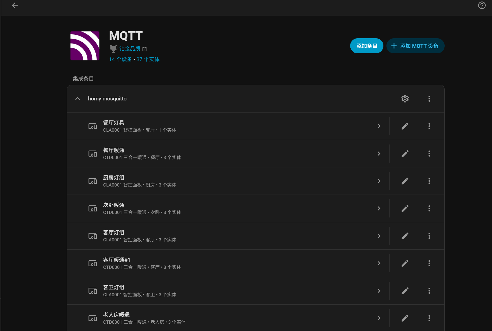

# homy-ha-bridge

宏云智能家居 CT-105H 网关设备接入 [Home Assistant](https://www.home-assistant.io/) 的 MQTT 桥接器。

本项目通过桥接进程把云端设备状态实时转成本地 MQTT 消息，并利用 HA 的 MQTT Discovery 自动生成实体，无需手写任何 HA 配置。



## 工作原理

```
宏云云 MQTT (8883/TLS) ←→ bridge 容器 (honymqtt / bridge / hadiscovery)
                              ↓ 本地 mosquitto (retained 消息)
                        Home Assistant (MQTT Discovery)
```

- `homycloud.py` — HTTP API SDK：登录（签名 + RSA 加密密码）、token 持久化、家庭/房间/设备查询
- `honymqtt.py` — 云端 MQTT 客户端：设备状态订阅与控制命令发布
- `bridge.py` — 桥接核心：云端状态 → 本地 MQTT 状态/retained 消息，HA 命令 → 云端控制
- `hadiscovery.py` — 按设备类型生成 HA Discovery 配置（light / climate / fan）
- `devices.json` — 设备命名翻译表：APP 房间/设备名 → HA 实体名，全部按名字匹配

## 支持的设备类型

| 云端设备类型 | HA 实体 |
|---|---|
| 智控面板（每个按键回路） | light（风机类回路可为 fan） |
| 三合一暖通控制器 | 空调 climate + 地暖 climate + 新风 fan，三路独立可分设 |
| 网关本身 | 在线状态 |

设备用 APP 里已有的「房间名/设备名」接入，启动时自动解析成 deviceId，全程不需要填设备 ID。

## 前置要求

- 宏云 APP 账号（手机号 + 密码）
- Docker + Docker Compose
- 已启用 MQTT 集成的 Home Assistant（HA 与桥接连同一个 MQTT broker）

> **重要限制**：宏云云端对同一账号的 MQTT 连接只保留一个会话，桥接与 APP 会互踢。建议为 HA 单独注册一个账号加入家庭，或接受「开桥接时 APP 收不到推送」。

## 快速开始

```bash
# 1. 准备外部网络（HA 容器需与 broker 同网络，按需改名）
docker network create mosquitto_default

# 2. 配置账号
cp .env.example .env
#    编辑 .env，至少填 PHONE / PASSWORD / FAMILY_NAME / MQTT_PASS

# 3. 启动（mosquitto + bridge 一起拉起）
docker compose up -d --build
```

启动后查看 `docker logs homy-bridge`：登录成功、家庭解析完成、retained 消息发布完成后，HA 里 MQTT 集成下即出现设备与实体。

## 配置说明

### `.env`

| 变量 | 填什么 |
|---|---|
| `PHONE` / `PASSWORD` | 宏云 APP 登录手机号和密码 |
| `FAMILY_NAME` | 目标家庭名（familyUuid 启动时自动解析） |
| `HOMY_ACCESS_SECRET` / `HOMY_REG_ID` | 协议常量，已内置默认值，留空即可 |
| `LOCAL_MQTT_HOST` / `LOCAL_MQTT_PORT` | 本地 broker 地址，默认容器名 `homy-mosquitto` |
| `MQTT_USER` / `MQTT_PASS` | broker 认证账号密码（mosquitto 启动时按此生成，HA 连接用同一组） |
| `TOKEN_HEARTBEAT_SECONDS` | 低频心跳间隔（秒），默认 600 |
| `CLOUD_RETRY_SECONDS` | 云端启动失败重试间隔（秒），默认 300 |

### `devices.json`

APP 设备名 → HA 实体的翻译表，全文件不填设备 ID。设备名三种写法：

- `设备名`（全家唯一）
- `房间/设备名`（要区分房间）
- `房间/设备名@N`（同房间同名多台，N=APP 里该房间第几台）

智控面板在 `channels` 里按 `switch_1.2.3.4` 逐键起名；几块面板物理联动（按一键全组响应）时只给主面板出实体，镜像面板标 `_mirror_only`。整个文件删掉也能跑：HA 用 APP 原名，暖通照常出实体，只有面板出不了灯。启动时名字对不上会报错并列出 APP 现有名字，照着改即可。

## 已知限制

- 网关必须在线，网关掉线则全部子设备不可控
- MQTT 连接被拒（CONNACK rc=5）= 账号/密码/家庭参数错误，先核对本方配置
- 云端协议变更可能导致桥接失效


## 免责声明

本项目仅供学习交流使用，不得用于任何商业用途。使用者自行承担使用风险。
